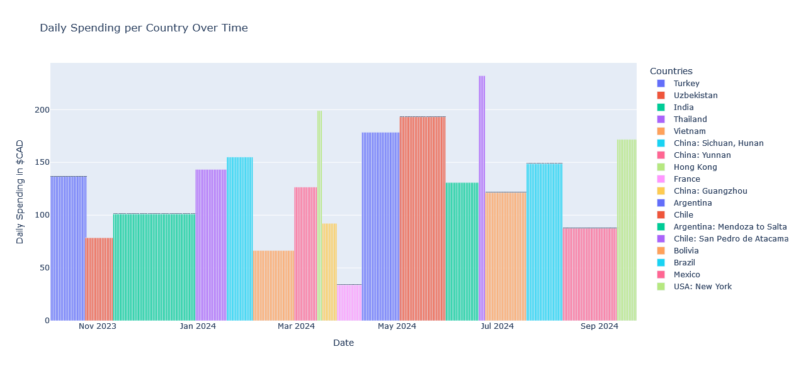

# en-cavale visual

Web application to visualize spendings during a year of travels.
It is deployed on a small virtual private server (Ubuntu VPS) and accessible here: https://victorng.fr/



## Setup

[pyenv](https://github.com/pyenv/pyenv) is _recommended_ to handle the Python version. We use Python 3.11.

```shell
pyenv install 3.10
pyenv global 3.10
```

[Poetry](https://python-poetry.org/) is used for dependency management and virtual environment handling.

```shell
curl -sSL https://install.python-poetry.org | python3 -
poetry install
```

Useful commands:

```
# Add Python package.
poetry add psycopg
# Load the virtual environment.
poetry shell
```

## Running the app

### Database

Start database container.

```
docker-compose up -d
```

### Backend

Start the Flask application as a backend process.

```
# In the backend directory.
poetry shell
flask run
```

### Frontend

Start the development server in the [frontend directory](frontend).

```sh
npm run dev
```

## IDE

Select appropriate Python interpreter. It is in the virtual environment provided by `poetry env info --path`.

## Database

We use the default username `postgres`.
To connect to the DB, We use the CLI tool `psql` and the web interface of adminer. **DBeaver** is also a recommended client.

Data are imported from a Google sheet.

## Deployment

Details can be found [here](Deployment.md).

## TODO

Apply migrations/versioning with Alembic or liquibase.
